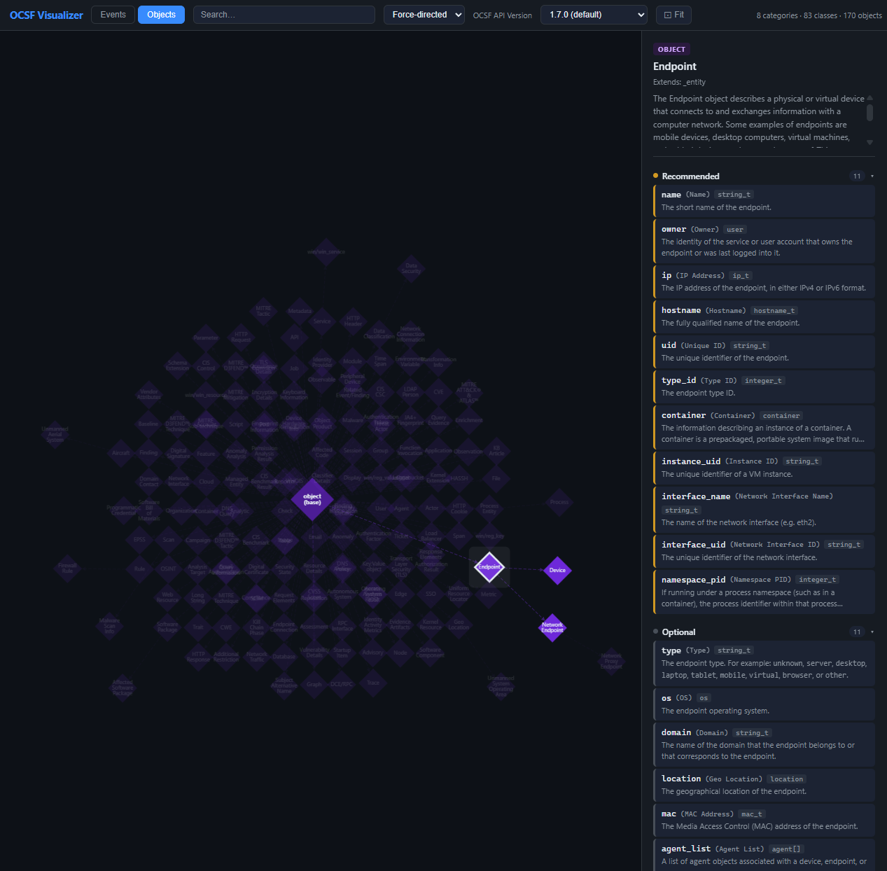

# OCSF Schema Visualizer

An interactive, browser-based graph explorer for the [Open Cybersecurity Schema Framework (OCSF)](https://schema.ocsf.io) schema. No build step, no dependencies to install — just a single `index.html`.

**[Live demo →](http://procko.pro/ocsf-visualizer/)**

---

## What it does

The OCSF schema defines a standardized taxonomy for security event data — categories, event classes, and reusable objects. This tool fetches that schema live from the public OCSF API and renders it as a navigable node graph, making it easy to explore relationships and attribute details without reading raw JSON.



---

## Features

- **Interactive graph** — pan, zoom, and click nodes to explore the schema
- **Two views**
  - **Events** — categories as large rectangles, event classes as circles, connected by inheritance and containment edges
  - **Objects** — full object inheritance tree rooted at the base `object` type
- **Detail panel** — click any node to load its full attribute list, grouped by requirement level (Required / Recommended / Optional)
- **Version switcher** — switch between any published OCSF schema version; data reloads automatically
- **Search** — filters and highlights matching nodes across the graph
- **Layout options** — Force-directed, Hierarchical, Circle, Grid
- **Fit to screen** button
- Hover tooltips on nodes

### Node types

| Shape | Color | Meaning |
|---|---|---|
| Rounded rectangle | Blue (per-category) | Category |
| Circle | Colored by category | Event Class |
| Diamond | Purple | Object |

### Attribute requirement colors

| Color | Meaning |
|---|---|
| Red | Required |
| Yellow | Recommended |
| Gray | Optional |

---

## How it works

Everything runs in the browser. There is no backend.

1. On load, the app calls `https://schema.ocsf.io/api/versions` to discover available schema versions and populate the version dropdown.
2. For the selected version, it fetches `/categories`, `/classes`, and `/objects` in parallel.
3. Graph elements are built from that data and rendered using [Cytoscape.js](https://cytoscape.org/) (loaded from a CDN).
4. When you click a node, the app lazily fetches the full detail for that class or object from the API and displays attributes in the side panel.
5. All fetched details are cached in memory for the session — switching back to a previously viewed node is instant.

### Data source

All schema data comes from the public OCSF API at `https://schema.ocsf.io`. No data is bundled in the repo. This means the visualizer always reflects the live schema, and switching versions actually reloads from the correct versioned endpoint (`https://schema.ocsf.io/{version}/api`).

---

## Usage

### GitHub Pages (easiest)

The app is a single `index.html` with no build step, so it deploys to GitHub Pages directly:

1. Create a new GitHub repository and push this repo's contents to it
2. Go to **Settings → Pages → Source** and select your branch (e.g., `main`)
3. GitHub Pages will serve it at `https://<your-username>.github.io/<repo-name>`

CORS is not an issue — `schema.ocsf.io` returns `Access-Control-Allow-Origin: *`, so browser requests from any hosted origin work fine.

### Local server

Opening `index.html` as a `file://` URL will be blocked by browser CORS policy. Serve it over HTTP instead:

```bash
# Python
python3 -m http.server 8080

# Node.js
npx serve .
```

Then open `http://localhost:8080`.

---

## File structure

```
ocsf-visualizer/
├── index.html       # Entire application — HTML, CSS, and JavaScript in one file
├── screenshot.png   # UI screenshot used in this README
└── README.md
```

The entire application is self-contained in `index.html`. No additional files are required to run it.

### External dependencies (CDN only)

| Library | Version | Purpose |
|---|---|---|
| [Cytoscape.js](https://cytoscape.org/) | 3.29.2 | Graph rendering and interaction |

---

## Keyboard / interaction reference

| Action | Result |
|---|---|
| Click a node | Load and show details in the right panel |
| Click background | Clear selection and dim |
| Scroll | Zoom in/out |
| Click + drag | Pan |
| Search box | Highlight matching nodes and fit view |
| Layout dropdown | Re-run layout algorithm |
| ⊡ Fit button | Zoom to fit all nodes |

---

## OCSF version support

The app supports all versions published by `schema.ocsf.io/api/versions`. Stable releases are sorted above pre-release versions. The API's default version is pre-selected on load.

---

## Contributing / modifying

The entire app is in `index.html`. The JavaScript is organized into clearly labeled sections:

| Section | What it does |
|---|---|
| `Config` | API root URL and per-category color maps |
| `State` | Single `S` object holds all runtime state |
| `API` | `apiFetch`, and data normalization helpers |
| `Cytoscape styles` | All graph visual styles |
| `Graph builders` | `buildEventEls()` and `buildObjectEls()` construct Cytoscape element arrays |
| `Cytoscape init` | `initCy()` creates/recreates the graph and binds events |
| `Tab switch` | Switches between Events and Objects views |
| `Node click / detail panel` | Handles clicks, loads detail data, manages fade/highlight |
| `Detail renderers` | HTML generation for category, class, and object detail panels |
| `Search` | Filters and animates to matching nodes |
| `UI helpers` | Tooltip, status, loading overlay, error states |
| `Version switching` | Rebuilds graph for a different OCSF schema version |
| `Schema loading` | `loadSchema()` — orchestrates the full data fetch and graph build |
| `Init` | `init()` — entry point, fetches versions and kicks off initial load |

---

## License

MIT

---

## Credits

Concept and design by [@tylerprocko](https://github.com/tylerprocko). Code written by [Claude Sonnet](https://claude.ai) (Anthropic).
